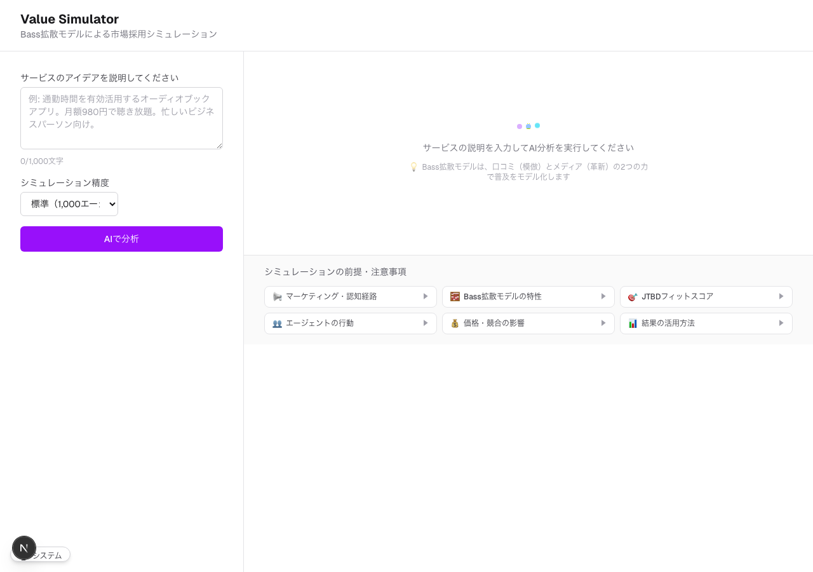
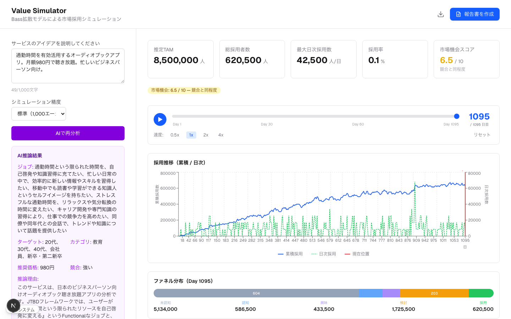
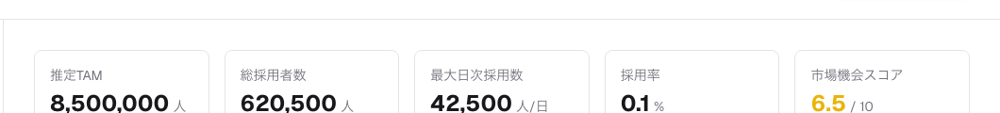
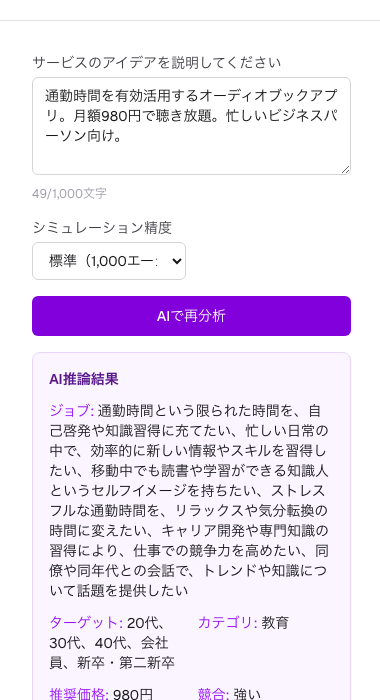
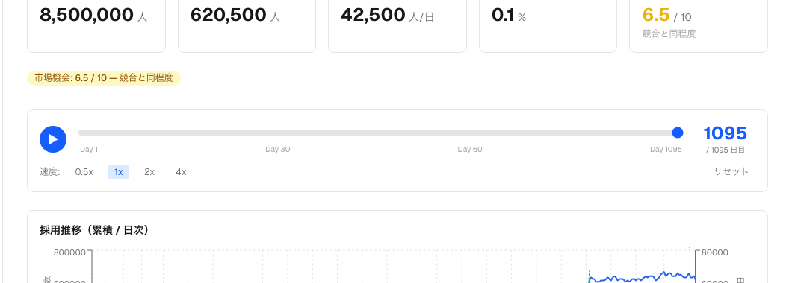
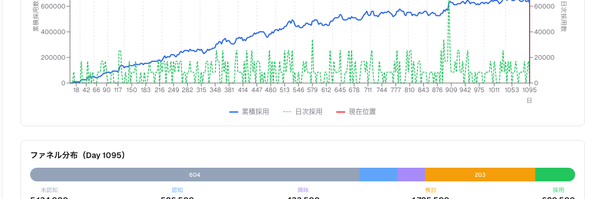

# Value Simulator

[](LICENSE)
[](https://www.python.org/)
[](https://nextjs.org/)

**Agent-based market adoption simulator** -- Simulate how your service idea would spread in the market.

**[Try it live](https://valuesimulator.pmdao.org/)** | [日本語](README.ja.md)

Place autonomous agents in a virtual representation of the Japanese market and run agent-based simulations powered by Bass diffusion theory. Visualize adoption curves, revenue projections, and improvement opportunities.

## How It Works

### Step 1: Describe your service idea



Enter a description of your service idea in the text area. Click "AI Analysis" and Claude API will automatically infer simulation parameters (JTBD, target users, category, pricing, competition).

### Step 2: Review AI inference + simulation results



The AI-inferred JTBD (jobs), target demographics, category, suggested price, and competition level are shown in the left panel. Parameters can be manually adjusted. Simulation results are displayed in real-time on the dashboard.

---

## Dashboard Details

### Summary Cards



| Metric | Description |
|--------|-------------|
| **Estimated TAM** | Total Addressable Market size in Japan, estimated by AI based on service description |
| **Total Adopters** | Cumulative number of agents who adopted the service during the simulation period |
| **Peak Daily Adoption** | Highest number of new adoptions in a single day. Indicates the peak momentum |
| **Adoption Rate** | Percentage of TAM that adopted the service. Measures market penetration |
| **Market Opportunity Score** | ODI (Outcome-Driven Innovation) score (0-10). Higher = more unmet needs in the market = higher chance of success |

### AI Inference Results



What Claude API infers from your description:

- **Jobs (JTBD)**: What users are trying to accomplish -- Functional, Emotional, and Social jobs
- **Target**: Age groups (20s, 30s...), occupations (office worker, student...), household types (single, couple...)
- **Category**: Best match from 25 categories (education, healthcare, SaaS, etc.)
- **Suggested Price**: Recommended monthly price based on market benchmarks and target willingness to pay
- **Competition**: None / Weak / Strong -- assessment of competitive landscape
- **Reasoning**: Explanation of the AI's inference process, including TAM estimation rationale

### Adoption Chart (Cumulative / Daily)



- **Blue solid line (Cumulative)**: S-curve (sigmoid). Shows the progression from innovators through early adopters to majority
- **Green dashed line (Daily)**: Bell curve. New daily adoptions. The classic Bass diffusion pattern: rise, peak, then decline
- **Red line (Current position)**: Position of the timeline slider

**Timeline controls**: Drag the slider to any simulation day. Press play for animated playback. Adjust speed (0.5x / 1x / 2x / 4x).

### Funnel Distribution (AIDMA Model)



Horizontal bar chart showing agent counts at each stage of the AIDMA purchase funnel:

| Stage | Description |
|-------|-------------|
| **Unaware** | Agents who don't know the service exists |
| **Aware** | Agents who know about the service but aren't interested |
| **Interest** | Agents actively gathering information |
| **Consideration** | Agents specifically considering purchase |
| **Adopted** | Agents who have purchased/adopted the service |

Transition probabilities between stages are determined by: Bass diffusion (innovation coefficient p + imitation coefficient q), JTBD fit score, price acceptance, and social network influence from neighboring agents.

---

## Key Features

- **Agent-based market simulation** -- Generate agents based on Japan demographics (e-Stat 2020 census). Connect via Watts-Strogatz small-world network. Individualize behavior by Rogers adoption categories (Innovators → Laggards)
- **Bass diffusion + AIDMA funnel** -- Combine innovation/imitation coefficients with a 5-stage purchase funnel model
- **JTBD + ODI opportunity score** -- 25 category presets with ODI scoring (`importance + max(importance - satisfaction, 0)`)
- **Claude API auto-inference** -- Just describe your service; AI infers JTBD, target, category, pricing, and competition
- **What-If analysis** -- Instantly preview the impact of parameter changes

## Quick Start

### Docker Compose (recommended)

```bash
git clone https://github.com/PM-DAO/value-simulator.git
cd value-simulator
docker compose up
# Open http://localhost:3000
```

### Local Development

**Prerequisites**: Python 3.11+, Node.js 20+, [uv](https://docs.astral.sh/uv/)

```bash
# Backend
cd backend
uv sync
PYTHONPATH=src uv run uvicorn simulator.api:app --reload  # http://localhost:8000

# Frontend (separate terminal)
cd frontend
npm install
NEXT_PUBLIC_API_URL=http://localhost:8000 npm run dev  # http://localhost:3000
```

## Architecture

```
Frontend (Next.js 16)          Backend (FastAPI)
┌──────────────────┐          ┌──────────────────────────────┐
│  Input Form      │  REST   │  api.py     ← Endpoints       │
│  Dashboard       │ ──────→ │  engine.py  ← Simulation      │
│  Scenario Compare│  JSON   │  agent.py   ← BDI Agents      │
│  (Recharts)      │         │  population.py ← Demographics │
└──────────────────┘          │  network.py ← Social Graph    │
                              │  diffusion.py ← Bass Model    │
                              │  funnel.py  ← AIDMA Funnel    │
                              │  jtbd.py    ← JTBD/ODI + LLM  │
                              │  market.py  ← Market Engine    │
                              └──────────────────────────────┘
```

### Backend Modules

| Module | Description |
|--------|-------------|
| `agent.py` | BDI (Beliefs-Desires-Intentions) agent model with demographics, Rogers category, funnel stage |
| `population.py` | Stratified sampling based on Japan census data (age, gender, income, region) |
| `network.py` | Watts-Strogatz small-world network (k=6, p=0.1) for social graph construction |
| `diffusion.py` | Bass diffusion: innovation coefficient (p) for spontaneous adoption, imitation coefficient (q) for word-of-mouth |
| `funnel.py` | AIDMA purchase funnel with stage transitions and decay (drop-off) at each stage |
| `jtbd.py` | JTBD/ODI opportunity scoring + Claude API LLM inference for auto-parameter detection |
| `market.py` | Price model application (free/freemium/subscription/usage/one-time), competition effects |
| `engine.py` | Simulation orchestrator. Runs all modules step-by-step (daily) with marketing event injection |
| `api.py` | FastAPI endpoints for simulation, auto-inference, and what-if analysis |

## API

| Endpoint | Description |
|----------|-------------|
| `POST /api/simulate` | Run simulation with manual parameters |
| `POST /api/simulate/auto` | AI auto-inference mode (Claude API infers parameters) |
| `POST /api/simulate/compare` | Scenario comparison (up to 3 simultaneous scenarios) |

API docs (Swagger UI): http://localhost:8000/docs

## Claude API Setup

To use AI auto-inference (automatic JTBD/target/pricing detection from service description), set your [Anthropic API key](https://console.anthropic.com/):

```bash
export ANTHROPIC_API_KEY=sk-ant-...
```

The simulator works without an API key -- you can manually set parameters and run simulations.

## Tests

```bash
# Backend unit tests
cd backend && uv run pytest

# With coverage
cd backend && uv run pytest --cov

# E2E tests (auto-starts backend + frontend)
cd frontend && npx playwright test
```

## Tech Stack

| Layer | Technology |
|-------|-----------|
| Backend | Python 3.11+, FastAPI, NetworkX, NumPy, SciPy, Pydantic |
| Frontend | Next.js 16 (App Router), React 19, Tailwind CSS v4, Recharts |
| LLM | Anthropic Claude API |
| Test | pytest, Playwright |
| Infra | Docker Compose |

## Development Model

Development happens in a private repository. Stable releases are synced to this public repository.

```
Private repo (daily dev)          Public repo (this repo)
  ├── Daily development             ├── Release versions only
  ├── WIP / experiments              ├── Clean commit history
  └── Testing                       └── Tagged versions
         │
         └── When stable ──squash push──→
```

- **Self-host**: Clone this repo and run it as-is
- **Code audit**: All source code is available for review
- **Contribute**: Submit PRs to this repository

## Contributing

Pull Requests are welcome.

1. Fork this repository
2. Create a feature branch (`git checkout -b feature/amazing-feature`)
3. Commit your changes (`git commit -m 'Add amazing feature'`)
4. Push and create a Pull Request

Bug reports and feature requests: [Issues](https://github.com/PM-DAO/value-simulator/issues)

## License

[AGPL-3.0](LICENSE)

This software is licensed under AGPL-3.0. If you provide this software as a SaaS (network service), you must make the source code available to users accessing it over the network. See [LICENSE](LICENSE) for details.
